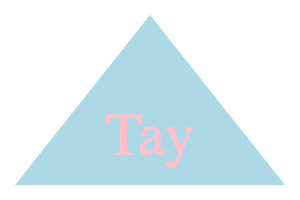

# Make an SVG Logo

## Description
Using Inquirer and node, I have created a command-line interface that creates a simple SVG logo based on user input. Part of my previous job as a brand specialist was to create logos for clients using Adobe Photoshop and Illustrator. While Adobe offers great products, the technology can be expensive and difficult to use for beginners. My app allows users to quickly generate logos without needing any graphic design skills or software.

Users will run node in their terminal and answer four questions indicating what shape, shape color, text, and text color they want for their logo. Once all questions have been answered, an SVG logo will be created automatically. If using the SVG VS Code extension, the SVG files can be exported and saved as PNGs.

This application challenged me to use classes and subclasse for the first time as well as Jest to test each class to ensure that the code executed correctly.

Link to video demo: 

Taylor Swift-themed sample logos:

## Installation
1. Copy the SSH key in my GitHub repo and paste `git clone <SSHKEY>` in your terminal to create a local copy on your computer\
OR
2. Download the zip file and manually copy the files to your computer
3. Install node by copying and pasting the code `npm init -y` in your terminal
4. Install the inquirer package by copying and pasting the code `npm i inquirer@8.2.4` in your terminal
5. Install jest by copying and pasting the code `npm install --save-dev jest`

## Usage
1. Open the index.js file in your terminal\
*Note*: Make sure you have installed the necessary applications! 
3. Run `node index.js` to start the application 
4. Type in answers to each question
5. Once you've answered the final question, a svg file titled "logo.svg" will be created6
6. 

## Credits 
- [Inquirer Package](https://www.npmjs.com/package/inquirer/v/8.2.4)
- [Jest Package](https://www.npmjs.com/package/jest)
- [Validate-Color Package](https://www.npmjs.com/package/validate-color) for validating colors
- [mozilla](https://developer.mozilla.org/en-US/docs/Web/SVG/Tutorial/Getting_Started) for how to write SVG files and getting the coordinates for shapes
- [codepen](https://codepen.io/pen/) to test what my image would look like
- Bootcamp tutor John Titus helped me come up with the method for creating the shapes and made sure I was writing the class constructors correctly

## License
MIT License